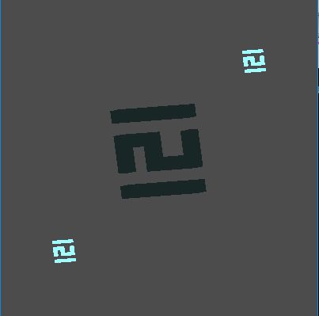

# Project Praktikum Komputer Grafik All

## Language

-  

## Screenshot

- Modul 1 No 2

    

- Modul 1 No 3

    

- Modul 1 No 4a

    

- Modul 1 No 4b

    

- Modul 2 No 1

    

- Modul 2 No 2

    

- Modul 2 No 3

    

- Modul 2 No 4

    

- Modul 3 No 1

    

- Modul 3 No 2

    

- Modul 3 No 3

    

- Modul 4 No 1

    

- Modul 4 No 2

    

- Modul 4 No 3

    

- Modul 5 No 1

    

- Modul 5 No 2

    

- Modul 5 No 3

    

- Modul 5 No 4

    

- Modul 6 No 1

    

- Modul 6 No 2

    

- Modul 6 No 3

    

- Modul 6 No 4

    

- Tugas Modul 3 4 5 6

    

## License
> This program is Free Software: 
You can use, study, share and improve it at your will. 
Specifically you can redistribute and/or modify it under the terms of the [GNU General Public License](https://www.gnu.org/licenses/gpl.html) 
as published by the Free Software Foundation, either version 3 of the License, or (at your option) any later version.
